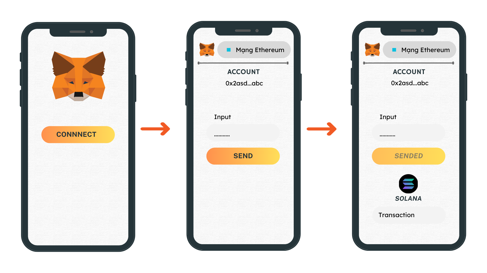

# Create a transaction in Solana with an EVM keypair

## Project description
The project comprises of two main components. The first component involves using `MetaMask` wallet to sign and create the signature from your message. The second component involves writing a custom program and deploying it on the `Solana` network. Bringing these two components together is the main objective of this project, showcasing how to create and transmit a transaction in Solana using an EVM keypair for signing, along with interacting with the Solana network through a custom program.

These are the references:
* [Secp256k1 Program](https://docs.solana.com/developing/runtime-facilities/programs#secp256k1-program)
* [Signing data with Metamask](https://docs.metamask.io/guide/signing-data.html#signtypeddata-v4)
* [How to Connect a React DApp to MetaMask](https://olawanlejoel.hashnode.devhow-to-connect-a-react-dapp-to-metamask-cl3d1kosd09n2x2nvghwz3rwu)
* [How to Write Your First Anchor Program in Solana](https://www.quicknode.com/guides/solana-development/anchor/how-to-write-your-first-anchor-program-in-solana-part-1/)

## Table of Contents
- [Create a transaction in Solana with an EVM keypair](#create-a-transaction-in-solana-with-an-evm-keypair)
  - [Project description](#project-description)
  - [Table of Contents](#table-of-contents)
  - [Connect and Signing with Metamask:](#connect-and-signing-with-metamask)
  - [Write Solana Program:](#write-solana-program)
  - [Combination:](#combination)
  - [Discoveries:](#discoveries)
  - [Install and run](#install-and-run)
    - [In user role](#in-user-role)
    - [In server role](#in-server-role)
    
## Connect and Signing with Metamask:
* Create a simple DApp to connect with your Metamask wallet.
* Creaet input box for user to input the message.
* Signing your message with `Metamask` by using `personal_sign` method. (Note: It is necessary to convert the message to hex and add the currency `0x`)
* Verify this signature by using `ethers.utils.verifyMessage` to verify the signature.

## Write Solana Program:
* Write a simple transaction to interact with the `Secp256k1 Program` on the `Solana` network.
* Write your own program to create PDA accounts and deploy it to the `Solana` network.
* Write your own client.ts to interact with the program you wrote.

## Combination:
* Create `client` and `server`, client to interact with metamask wallet, and server to interact with solana network.
* Get the signature, message, publickey of the eth address and wrap it up as the data of an instruction and send it to the server (Note: The message should be modified because when using the personal_sign method the message was modified to `\x19Ethereum Signed Message:\n${message.length}${message}`)
* Update your program has written above, create 2 functions, one is create PDA account has amount, another is transfer amount from one PDA account to another PDA account ([Example](https://beta.solpg.io/643cfedb67edfe0f00106a25))
* The server will create a transaction with 2 instructions, one to send to the Secp256k1 Program to verify the signature of the metamask wallet and one to interact with your Program. 
  
## Discoveries:
* If it only takes one person to sign, use `sign`.
* To accommodate multiple signers, use `transaction.partialSign(signer)` to sign the transaction. Using `transaction.sign(signer)` would nullify the signatures of previous signers, preventing confirmation of transactions with multiple signers.
* If you serialize the same transaction multiple times, the network state will be out of sync, so set `skipPreflight:true` when use `sendEncodedTransaction` instead of `sendTransaction` to avoid issues.

## Install and run

### In user role
```bash
yarn start
```

### In server role
```bash
node server.js
```


